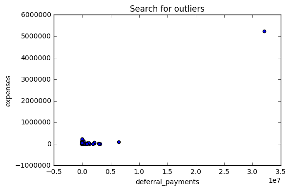
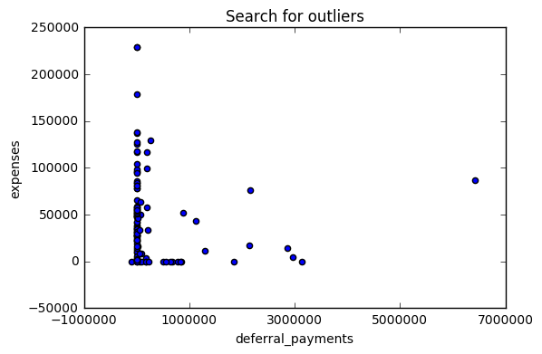
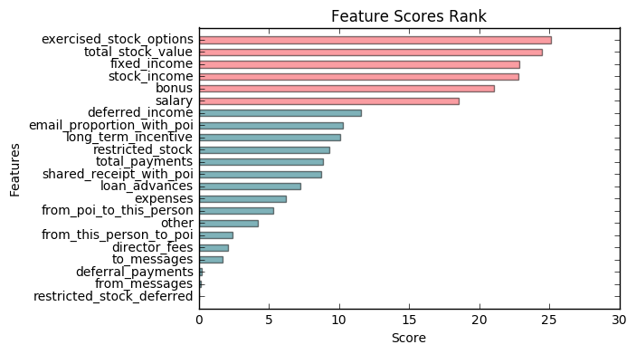
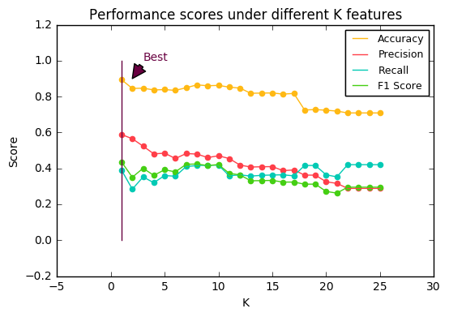
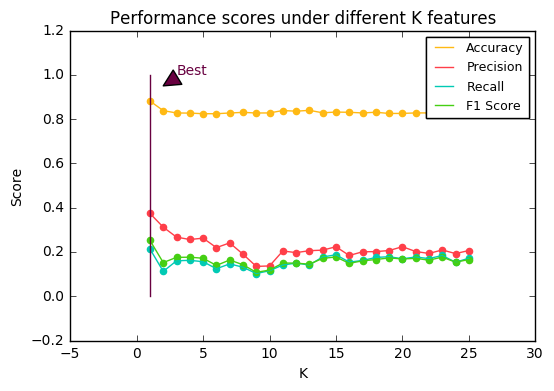

# Machine learning to analyze Enron Dataset
**Udacity Nanodegree P5 project**

*Author: Jie Hu,  jie.hu.ds@gmail.com*

------------

## 0. Abstract

This is a project in which I use skills learned from Udacity course, including data wrangling, exploratory data analysis and machine learning, to do research on [Enron Fraud Email dataset](https://www.cs.cmu.edu/~./enron/).

The goal of this research is to find out most significant features to predict whether a person in the dataset is committed to fraud. The structure of this article is:
- Data Wrangling, in which I modify NA values and remove outliers
- Feature Selecting, in which I create some features I think important to predict fraud
- Training and tuning machine learning, in which I use sklearn to train 4 different models and compare their performance matrices, including precision, recall and f1 score
- Final part, in which I select Naive Bayes as my best model
- Conclusion

## 1. Data Wrangling

Firstly, load the dataset:


```python
#!/usr/bin/python

import sys
import pickle
sys.path.append("../tools/")

from feature_format import featureFormat, targetFeatureSplit
from tester import dump_classifier_and_data

```


```python
with open("final_project_dataset.pkl", "r") as data_file:
    data_dict = pickle.load(data_file)
```

The dataset has 146 observations (people) including 18 person of interest (poi). And there're totally 21 features. Beside 'email_address' (string) and 'poi' (bool), all features are numeric.

It's a highly skewed data because the target 2 labels for classification are greatly unbalanced: poi people take up only 12.3% dataset.

Beside, the data has a lot of NA values of each features:


```python
persons = data_dict.keys()
keys = data_dict[data_dict.keys()[1]].keys()
```


```python
# Check 'NaN' value of each feature in dict_data
NA_count = {}

for person in persons:
    for key in keys:
        if data_dict[person][key] == 'NaN':
            if not NA_count.has_key(key):
                NA_count[key] = 1
            else:
                NA_count[key] += 1
```


```python
NA_count
```


    {'bonus': 64,
     'deferral_payments': 107,
     'deferred_income': 97,
     'director_fees': 129,
     'email_address': 35,
     'exercised_stock_options': 44,
     'expenses': 51,
     'from_messages': 60,
     'from_poi_to_this_person': 60,
     'from_this_person_to_poi': 60,
     'loan_advances': 142,
     'long_term_incentive': 80,
     'other': 53,
     'restricted_stock': 36,
     'restricted_stock_deferred': 128,
     'salary': 51,
     'shared_receipt_with_poi': 60,
     'to_messages': 60,
     'total_payments': 21,
     'total_stock_value': 20}


So the first thing needed to be done is to replace these 'NaN' values.
Because for financial data, 'NaN' most likely mean he/she had no such income, so it's 0 
And for email data, it can also be 0 if there's no such count, so I replace all numeric 'NaN' values by 0. Now most NA values are replaced, we only have people without email address, which is reasonable and can be ignored.


```python
# Before doing any feature selection and creation work, I remove the 'NaN'
# Because for financial data, 'NaN' most likely mean he/she had no such income, so it's 0
# And for email data, it can also be 0 if there's no such count
for person in persons:
    for key in keys:
        if data_dict[person][key] == 'NaN' and key != 'email_address':
            data_dict[person][key] = 0
```


```python
# Now NAs have been removed (Only email has NaN but it doesn't matter):
NA_count = {}

for person in persons:
    for key in keys:
        if data_dict[person][key] == 'NaN':
            if not NA_count.has_key(key):
                NA_count[key] = 1
            else:
                NA_count[key] += 1
NA_count
```


    {'email_address': 35}


The pros of such NA value replacement are:

- use reasonable logic to better fit the data
- good for training models

But there's con:
- some data might be real missing values (real value can be non-0!), for example, typo, unintended missing etc. Set them to 0 might have risk to bias the result

To go deeper, I have to assume the NA data be all values such person doesn't have.

Beside, outliers are harmful for analysis. After all, they can significantly biased any model. For example, if I use Decision Tree, outliers can setup new rules but actually it's sometimes meaningless. However, some outliers, if they are not a wiered point, and it belongs to the true data, I will keep them.

Here let's check if there's strange outliers. Let's pick up some feature combination and use scatter plot to check:


```python
### Task 3: Remove outliers

# Because I'm not using simple linear model for next steps 
# so if the outliers are from data points, even it's outlier, I will keep it
# otherwise I will remove it

# Firstly, let's do some visualization by using 2-dimensional data

features_list = ['deferral_payments','expenses']

### Store to my_dataset for easy export below.
my_dataset = data_dict

### Extract features and labels from dataset
data = featureFormat(my_dataset, features_list, sort_keys = True)

import matplotlib.pyplot as plt

for point in data:
    deferral_payments = point[0]
    expenses = point[1]
    plt.scatter( deferral_payments, expenses )

plt.xlabel("deferral_payments")
plt.ylabel("expenses")
plt.title("Search for outliers")
plt.show()
```





We can see there's one point significantly far from center, let's see what it is:


```python
for person in persons:
    if data_dict[person]['deferral_payments'] > 20000000:
        print person
```

    TOTAL


It's unlikely for anyone to have name 'TOTAL', a more reasonable explaination is that this is summary of sum of feature values. So I remove this 'TOTAL' otherwise it might bias my models.


```python
data_dict.pop('TOTAL')
```


    {'bonus': 97343619,
     'deferral_payments': 32083396,
     'deferred_income': -27992891,
     'director_fees': 1398517,
     'email_address': 'NaN',
     'exercised_stock_options': 311764000,
     'expenses': 5235198,
     'from_messages': 0,
     'from_poi_to_this_person': 0,
     'from_this_person_to_poi': 0,
     'loan_advances': 83925000,
     'long_term_incentive': 48521928,
     'other': 42667589,
     'poi': False,
     'restricted_stock': 130322299,
     'restricted_stock_deferred': -7576788,
     'salary': 26704229,
     'shared_receipt_with_poi': 0,
     'to_messages': 0,
     'total_payments': 309886585,
     'total_stock_value': 434509511}


Then let's zoom in and see if there's other unreasonable outliers


```python
features_list = ['deferral_payments','expenses']

### Store to my_dataset for easy export below.
my_dataset = data_dict

### Extract features and labels from dataset
data = featureFormat(my_dataset, features_list, sort_keys = True)

for point in data:
    deferral_payments = point[0]
    expenses = point[1]
    plt.scatter( deferral_payments, expenses )

plt.xlabel("deferral_payments")
plt.ylabel("expenses")
plt.xticks(range(-1000000, 8000000, 2000000))
plt.title("Search for outliers")
plt.show()
```





At least 4 outliers are detected visually. Let's look at these outliers


```python
persons.remove('TOTAL')
for person in persons:
    if data_dict[person]['deferral_payments'] > 5000000 or data_dict[person]['expenses'] > 150000:
        print person
```

    SHANKMAN JEFFREY A
    URQUHART JOHN A
    MCCLELLAN GEORGE
    FREVERT MARK A


These are all names of people, and they are not by mistakes. Since they include much information I need, to keep these outliers will be a good choice.

After check other combinations, I decide to keep all remaining data because the outliers will have a lot of information which could be significant indicator of poi.

## 2. Feature Selecting

Firstly, I create 3 features I think could possibly be indicators for poi:

- 'fixed_income': earned from how they contribute to work, salary + bonus
- 'stock_income': all income from stock, restricted_stock_deferred + exercised_stock_options + restricted_stock
- 'email_proportion_with_poi': 
- proportion of their emails frequency with poi over all email

Then, to begin with, I use all features and, under each algorithm I tune, use KBest to select features by their scores and compare the recall/precision rate.


```python
### Task 1: Select what features you'll use.
### features_list is a list of strings, each of which is a feature name.
### The first feature must be "poi".

### Task 3: Create new feature(s)
# Then I create features:
# created_feature_list:

for person in persons:
    salary = float(data_dict[person]['salary'])
    bonus = float(data_dict[person]['bonus'])
    restricted_stock_deferred = float(data_dict[person]['restricted_stock_deferred'])
    exercised_stock_options = float(data_dict[person]['exercised_stock_options'])
    restricted_stock = float(data_dict[person]['restricted_stock'])
    
    from_this_person_to_poi = float(data_dict[person]['from_this_person_to_poi'])
    shared_receipt_with_poi = float(data_dict[person]['shared_receipt_with_poi'])
    from_poi_to_this_person = float(data_dict[person]['from_poi_to_this_person'])
    to_messages = float(data_dict[person]['to_messages'])
    from_messages = float(data_dict[person]['from_messages'])
    
    data_dict[person]['fixed_income'] = salary + bonus 
    data_dict[person]['stock_income'] = (restricted_stock_deferred + \
                                         exercised_stock_options + \
                                         restricted_stock)
    data_dict[person]['email_proportion_with_poi'] = (from_this_person_to_poi + \
                                                         shared_receipt_with_poi + \
                                                         from_poi_to_this_person)/ \
                                                        (to_messages + from_messages + 1)
                                         
# Email address should be removed because it's meaningless to our target   
lst = data_dict[persons[0]].keys()
lst.remove('email_address')
lst.pop(lst.index('poi'))
lst.insert(0, 'poi')
    

features_list = lst + ['fixed_income', 'stock_income', 'email_proportion_with_poi']

### Store to my_dataset for easy export below.
my_dataset = data_dict

### Extract features and labels from dataset
data = featureFormat(my_dataset, features_list, sort_keys = True)
labels, features = targetFeatureSplit(data)
```

One more step before start fitting is re-scale the data by sklearn.MinMaxScaler, because some of the algorithms I will implement might require re-scale features to avoid skewed distance and biased result.


```python
from sklearn import preprocessing

min_max_scaler = preprocessing.MinMaxScaler()
features = min_max_scaler.fit_transform(features)
```


```python
from sklearn.feature_selection import SelectKBest
from sklearn.feature_selection import f_classif

data_all = SelectKBest(f_classif, k='all').fit(features,labels)
```


```python
# fit_transform(X, y)
import operator

scores = data_all.scores_
score_dict = {}
for ii in range(len(features_list) - 1):
    score_dict[features_list[ii+1]] = round(scores[ii],2)

sorted_score_dict = sorted(score_dict.items(), key=operator.itemgetter(1), reverse=False)

```

Then I plot the features sorted by their scores:


```python
features_lst = [item[0] for item in sorted_score_dict]
y_pos = np.arange(len(features_lst))
scores = [item[1] for item in sorted_score_dict]
bar_pos_rate = 1.5 # adjust gap between bars

colors = ["#f63d47" if score > 15 else "#006775" for score in scores]
plt.barh(y_pos*bar_pos_rate, scores, 0.8, align='center', alpha=0.5, color = colors)
plt.yticks(y_pos*bar_pos_rate, features_lst)
plt.ylabel('Features')
plt.title('Feature Scores Rank')
plt.xlabel("Score")
plt.ylim([min(y_pos*bar_pos_rate) - bar_pos_rate, max(y_pos*bar_pos_rate) + bar_pos_rate])
features_lst.reverse() # will use this later
plt.show()
```





From the plot, it seems 6 is a great cut-off to select features because more than 6 features will not have high score. However, here I will keep this plot as a reference, I will explore more about how the recall rate and precision rate will be changed and then compare all these plot to select best combination.

## 3. Training and Tuning Machine Learning

Before training, I will use validation to see how algorithms generalized to the overall data outside training data. Without validation, there's pretty high risk of overfitting.

After that, I run each model independently and tune for the best performance of each type of model.

### 3.1 About Tuning Models

It's very important to tune the model, not only because each model, there might be a lot of combination of parameters and hence make big influence on performance of our model, but also, we can have better chance to see how model can better match the data in an optimization process.

Without tuning the model, we might save a lot of time and get a good result, but there's always a question "can we do better" over the head. And if the model get bad prediction when there's new data coming, we even don't know where the problem is. So tune the model might cost sometime, but it did save time in future for further exploration and better improved the performance and robustness of model.


### 3.2 Naive Bayes

Similarly, I tune the model for each K from 1 to 25, and plot the performance matrices:


```python
### Task 4: Try a varity of classifiers
### Please name your classifier clf for easy export below.
### Note that if you want to do PCA or other multi-stage operations,
### you'll need to use Pipelines. For more info:
### http://scikit-learn.org/stable/modules/pipeline.html

from sklearn.cross_validation import train_test_split
from sklearn.model_selection import GridSearchCV
from sklearn.metrics import precision_score, recall_score, accuracy_score, f1_score
import numpy as np

# classifier test function
# extract data with k best features
# use stratified sampling iteratively to get precision / recall / f1 / accuracy
# return the 4 average scores

def classifer_tester(classifier, features_lst, parameters, k, iterations=100):
    
    precision = []
    recall = []
    accuracy = []
    f1score = []
    
    ### Extract data with k best features
    my_dataset = data_dict
    k_best_features_list = ['poi'] + features_lst[0:k]
    # print k_best_features_list
    ### Extract features and labels from dataset
    data = featureFormat(my_dataset, k_best_features_list, sort_keys = True)
    labels, features = targetFeatureSplit(data)
    
    ### Iteratively to get average scores
    for ii in range(iterations):
        
        features_train, features_test, labels_train, labels_test = train_test_split(features, 
                                                                                    labels, 
                                                                                    random_state=ii*10,
                                                                                    stratify = labels)
        grid_search = GridSearchCV(classifier, parameters)
        grid_search.fit(features_train, labels_train)
        predictions = grid_search.predict(features_test)
        precision.append(precision_score(labels_test, predictions))
        recall.append(recall_score(labels_test, predictions))
        accuracy.append(accuracy_score(labels_test, predictions))
        f1score.append(f1_score(labels_test, predictions))
    
    precision_mean = np.array(precision).mean()
    recall_mean = np.array(recall).mean()
    accuracy_mean = np.array(accuracy).mean()
    f1score_mean = np.array(f1score).mean()
    
    return precision_mean, recall_mean, accuracy_mean, f1score_mean
    
#     print '------------------------'
#     print 'Accuracy: %s' % "{:,.2f}".format(round(accuracy_mean, 2)) 
#     print 'Precision: %s' % "{:,.2f}".format(round(precision_mean, 2))
#     print 'Recall   : %s' % "{:,.2f}".format(round(recall_mean, 2))
#     print 'F1 score:  %s' % "{:,.2f}".format(round(f1score_mean, 2))
    
#     print 'Best parameters:\n'
#     best_parameters = grid_search.best_estimator_.get_params() 
#     for parameter_name in sorted(parameters.keys()):
#         print '%s: %r' % (parameter_name, best_parameters[parameter_name])

```


```python
precisions = []
recalls = []
accuracies = []
f1scores = []

for k in range(1,26):
    precision, recall, accuracy, f1score = classifer_tester(GaussianNB(), 
                                                            features_lst=features_lst, 
                                                            parameters={}, 
                                                            k=k)
    precisions.append(precision)
    recalls.append(recall)
    accuracies.append(accuracy)
    f1scores.append(f1score)
```


```python
Ks = range(1,26)
plt.scatter(Ks,precisions, color = "#ff3f49")
precision_line, = plt.plot(Ks,precisions, label="Precision", color = "#ff3f49")
plt.scatter(Ks,recalls, color = "#01cab4")
recall_line, = plt.plot(Ks,recalls, label="Recall", color = "#01cab4")
plt.scatter(Ks,accuracies, color = "#ffb914")
accuracy_line, = plt.plot(Ks,accuracies, label="Accuracy", color = "#ffb914")
plt.scatter(Ks,f1scores, color = "#45cf13")
f1score_line, = plt.plot(Ks,f1scores, label="F1 Score", color = "#45cf13")
plt.annotate('Best', xy=(2, 0.9), xytext=(3, 1), color = "#680040",
            arrowprops=dict(facecolor='#680040', shrink=-1.35),
            )
plt.plot([1, 1], [0, 1], 'k-', lw=1, color = "#680040")
plt.title("Performance scores under different K features")
plt.xlabel("K")
plt.ylabel("Score")

# Create a legend for the first line.
legends = plt.legend(handles=[accuracy_line,
                              precision_line, 
                              recall_line,
                              f1score_line], 
                     fontsize = 9,
                     loc=1)
# Add the legend manually to the current Axes.
plt.gca().add_artist(legends)

plt.show()
```





The accuracy is an average score to show how much percentage we get the right prediction. As it's not suitable for skewed features, here I add precision and recall matrices to evaluate.


Precision is how much probability we get a sample with true if it's tested positive. By bayes prior and post probability:

$$Precision = P(T | +) = \frac{P(+|T)}{P(+|T)+P(+|F)}$$

In other words, precision is a measure of result relevancy, while recall is a measure of how many truly relevant results are returned:

$$Recall = \frac{P(+|T)}{P(+|T)+P(-|T)}$$

Here we can see from the plot when K=1, we get pretty good scores. Though after K = 22, the Recall score increases, but accuracy, precision and F1 Score are significantly lower. However, it might be due to the imbalance dataset. But here I will consider the best the model can reach from the training set and put only K=1 into candidate list for the Gaussian Naive Bayes model. When K=1, we can have:

- Higher precission means, with people identified as poi by this model, we have higher correct rate
- Higher recall means, if the people is poi, then we have higher chance to identify correctly

The higher recall and precision might make a lot of people commited guilty, even some are indeed innocent, but model is not the only way we use, the commitment is a very complicated process. Model can act as a reference but we should have lower risk to miss poi.

Next step, let's see how another algorithm, Decision Tree works.


### 3.2 Decision Tree

The process is similar, but here we should set the parameters of Decision Tree and use GridSearch and visualization to get the best performance.


```python
# Decision Tree

precisions = []
recalls = []
accuracies = []
f1scores = []

from sklearn import tree
clf = tree.DecisionTreeClassifier()

parameters = {'criterion': ['gini', 'entropy'],
               'min_samples_split': [2, 10, 20],
               'max_depth': [None, 2, 5, 10],
               'min_samples_leaf': [1, 5, 10],
               'max_leaf_nodes': [None, 5, 10, 20]}

for k in range(1,26):
    precision, recall, accuracy, f1score = classifer_tester(clf, 
                                                            features_lst=features_lst, 
                                                            parameters = parameters, 
                                                            k=k)
    precisions.append(precision)
    recalls.append(recall)
    accuracies.append(accuracy)
    f1scores.append(f1score)
```


```python
Ks = range(1,26)
plt.scatter(Ks,precisions, color = "#ff3f49")
precision_line, = plt.plot(Ks,precisions, label="Precision", color = "#ff3f49")
plt.scatter(Ks,recalls, color = "#01cab4")
recall_line, = plt.plot(Ks,recalls, label="Recall", color = "#01cab4")
plt.scatter(Ks,accuracies, color = "#ffb914")
accuracy_line, = plt.plot(Ks,accuracies, label="Accuracy", color = "#ffb914")
plt.scatter(Ks,f1scores, color = "#45cf13")
f1score_line, = plt.plot(Ks,f1scores, label="F1 Score", color = "#45cf13")
plt.annotate('Best', xy=(2, 0.95), xytext=(3, 1), color = "#680040",
            arrowprops=dict(facecolor='#680040', shrink=-1.35),
            )
plt.plot([1, 1], [0, 1], 'k-', lw=1, color = "#680040")
plt.title("Performance scores under different K features")
plt.xlabel("K")
plt.ylabel("Score")

# Create a legend for the first line.
legends = plt.legend(handles=[accuracy_line,
                              precision_line, 
                              recall_line,
                              f1score_line], 
                     fontsize = 9,
                     loc=1)
# Add the legend manually to the current Axes.
plt.gca().add_artist(legends)

plt.show()
```





From the plot we can see the model reach optimal when K = 1, however, this might due to overfitting when having more features, yet might also due to the same reason above that the training data is pretty unbalanced and size is small. Since the recall rate is waht we want to pay attention to beside accuracy, when K=1 the model also reach the optimal for recall score, so here I select K=1, feature list only involves ['exercised_stock_options'] as the best choice for feature. Here I use this to train and tune the Decision Tree model again to find the best combination of parameters:


```python
features_lst = ['poi', 'exercised_stock_options']

my_dataset = data_dict
data = featureFormat(my_dataset, features_lst, sort_keys = True)
labels, features = targetFeatureSplit(data)
features_train, features_test, labels_train, labels_test = train_test_split(features, 
                                                                                    labels, 
                                                                                    random_state=42,
                                                                                    stratify = labels)

clf = tree.DecisionTreeClassifier()

# parameters to tune the best Decision Tree model
parameters = {'criterion': ['gini', 'entropy'],
               'min_samples_split': [2, 10, 20],
               'max_depth': [None, 2, 5, 10],
               'min_samples_leaf': [1, 5, 10],
               'max_leaf_nodes': [None, 5, 10, 20]}

grid_search = GridSearchCV(clf, parameters)
grid_search.fit(features_train, labels_train)
predictions = grid_search.predict(features_test)

print "Precision: %f" % precision_score(labels_test, predictions)
print "Recall: %f" % recall_score(labels_test, predictions)
print "Accuracy: %f" % accuracy_score(labels_test, predictions)
print "F1 Score: %f" % f1_score(labels_test, predictions)
```

    Precision: 0.500000
    Recall: 0.333333
    Accuracy: 0.884615
    F1 Score: 0.400000


And the best parameters are:


```python
grid_search.best_estimator_
```


    DecisionTreeClassifier(class_weight=None, criterion='gini', max_depth=None,
                max_features=None, max_leaf_nodes=None,
                min_impurity_split=1e-07, min_samples_leaf=5,
                min_samples_split=2, min_weight_fraction_leaf=0.0,
                presort=False, random_state=None, splitter='best')


Here we care Recall the most because, under a reasonable precision, we want our model to predict as more poi as possible, try best avoid missing. Thus, K = 1 will be a better choice.

## 4. Final Discussion

Now let's put together and select the best model and feature list.

I notice both models reach optimal when K = 1:

Score Type|Naive Bayes| Decision Tree
------------|------------|------------
Accuracy|0.89|0.88
Precision|0.59|0.50
Recall|0.39|0.33
F1 score|0.43|0.40

Naive Bayes has the higher scores in all fields, therefore I will use Naive Bayes with K = 1 as my final model.

In the above steps, I used stratified sampling, iteratively to train models and get the best performance. It seems a lot of features are wasted, however, dataset's imbalance and small size contribute a lot to such result. To improve the model, we must try to figure out if there's other way to get more observations, especially people of interest.

Beside, the 3 features createdy by me are not working well than I expected, here let's make final comparison by the performance of Naive Bayes with / without created features:


```python
features_lst_with_new = ['poi', 'exercised_stock_options', 'fixed_income', 'stock_income', 'email_proportion_with_poi']
features_lst_without_new = ['poi', 'exercised_stock_options']

my_dataset = data_dict
data_with_new = featureFormat(my_dataset, features_lst_with_new, sort_keys = True)
data_without_new = featureFormat(my_dataset, features_lst_without_new, sort_keys = True)
labels1, features1 = targetFeatureSplit(data_with_new)
features_train1, features_test1, labels_train1, labels_test1 = train_test_split(features1, 
                                                                                    labels1, 
                                                                                    random_state=42,
                                                                                    stratify = labels1)

labels2, features2 = targetFeatureSplit(data_without_new)
features_train2, features_test2, labels_train2, labels_test2 = train_test_split(features2, 
                                                                                    labels2, 
                                                                                    random_state=42,
                                                                                    stratify = labels2)

clf1 = GaussianNB()
clf1.fit(features_train1, labels_train1)
predictions1 = clf1.predict(features_test1)
clf2 = GaussianNB()
clf2.fit(features_train2, labels_train2)
predictions2 = clf2.predict(features_test2)


print "\t\tWith New Features \tWithout New Features"
print "Precision: \t%f\t\t%f" % (precision_score(labels_test1, predictions1),precision_score(labels_test2, predictions2))
print "Recall: \t%f\t\t%f" % (recall_score(labels_test1, predictions1),recall_score(labels_test2, predictions2))
print "Accuracy: \t%f\t\t%f" % (accuracy_score(labels_test1, predictions1), accuracy_score(labels_test2, predictions2))
print "F1 Score: \t%f\t\t%f" % (f1_score(labels_test1, predictions1), f1_score(labels_test2, predictions2))

```

    		With New Features 	Without New Features
    Precision: 	0.666667		0.500000
    Recall: 	0.500000		0.333333
    Accuracy: 	0.909091		0.884615
    F1 Score: 	0.571429		0.400000


We can see all scores of the model with new features are lower than without new features. So I will remove these features from the final feature least. The final model is Naive Bayes.


```python
### Task 5: Tune your classifier to achieve better than .3 precision and recall 
### using our testing script. Check the tester.py script in the final project
### folder for details on the evaluation method, especially the test_classifier
### function. Because of the small size of the dataset, the script uses
### stratified shuffle split cross validation. For more info: 
### http://scikit-learn.org/stable/modules/generated/sklearn.cross_validation.StratifiedShuffleSplit.html
features_lst = ['poi', 'exercised_stock_options']


# Example starting point. Try investigating other evaluation techniques!
my_dataset = data_dict
data = featureFormat(my_dataset, features_lst, sort_keys = True)
labels, features = targetFeatureSplit(data)

from sklearn.cross_validation import train_test_split
features_train, features_test, labels_train, labels_test = \
    train_test_split(features, labels, test_size=0.3, random_state=42)


clf = GaussianNB()
    
### Task 6: Dump your classifier, dataset, and features_list so anyone can
### check your results. You do not need to change anything below, but make sure
### that the version of poi_id.py that you submit can be run on its own and
### generates the necessary .pkl files for validating your results.

dump_classifier_and_data(clf, my_dataset, features_list)
```

## 5. Conclusion

In this report I firstly summarize the dataset, remove outliers and replace NaN values. Next, I create 3 features and figure out which features to be selected by sklearn KBest method in tuning model process. In such process, I train 2 different models, and finally find Naive Bayes as my best model and K = 1, involving only 'exercised_stock_options' in my best feature list.

This is a quantative analysis and can only be a reference for commitment. The real procedure of convict guilty will be more complicated.

In future, to improve the accuracy of the model, I think there're some ways we can try:
- Given more detailed dataset, more features might have risk of overfitting, but more data can possibly provide more informaiton we need
- Mining more information from emails, for example, how they communicate with Enron's partners, how they poi communicate with each other


```python

```
